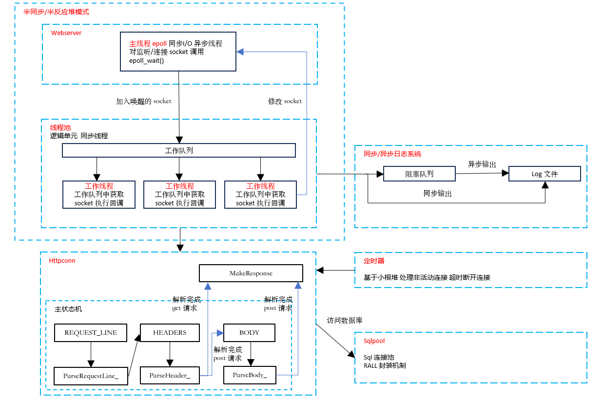
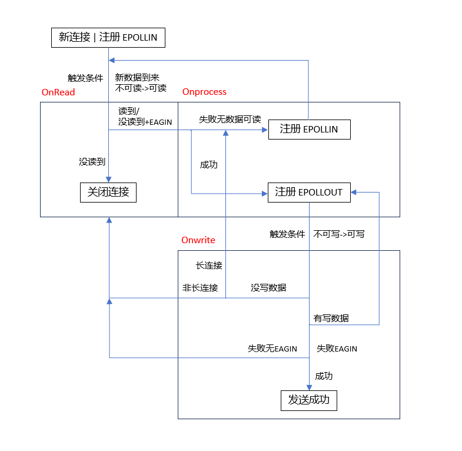

# myWebServer

[toc]

C++ 实现的 webserver 高性能服务器项目

## 功能模块



- server + pool：使用 I/O 复用技术和线程池实现的 Reactor 高并发模型
    - Epoller：对 epoll 进行包装
- buffer：基于 vector 实现的缓冲区，用于存储 http 读写数据，日志缓冲区
    - Buffer：vector 存储字节，同时实现读写安全

- log：使用单例模式和阻塞队列实现的同步/异步日志系统
    - BlockDeque：deque 实现的阻塞队列，异步模式下输出到阻塞队列，再由异步线程处理队列任务
    - Log：日志类，使用单例模式
- sqlpool：使用 MySQL 数据库存储用户信息，建立连接池，提高了逻辑单元对数据的访问效率
    - SqlConnRAII：使用 RAII 机制实现了数据库连接池，减少开销同时实现注册登录功能
    - ThreadPool：线程池
- http：正则与状态机解析 HTTP 请求报文，支持解析 GET 和 POST 请求
    - HttpRequest：解析 http 请求报文，分为解析请求行，路径，头，体，使用正则表达式进行解析
    - HttpResponse：构造响应报文
    - HttpConn：保存 Client，调用 request 和 response，解析 client 发来的请求，生成相应的信息，最后发送给 Client，主要函数是 Onprocess

- timer：小根堆实现的定时器，关闭超时的非活动连接
    - TimerNode：计时器结点
    - HeapTimer：vector 模拟的小根堆，存储 TimerNode


Webserver 中 OnRead OnWrite OnProcess 事件处理逻辑




## 文件结构

```python
.
├── Makefile
├── README.md
├── bin
│   └── server
├── build
│   └── Makefile
├── code
│   ├── buffer
│   ├── config
│   ├── http
│   ├── log
│   ├── main.cc
│   ├── pool
│   ├── server
│   └── timer
├── resources
└── webbench-1.5
```


## 项目启动

环境要求：Linux + C++14 + MySql

创建 MySQL 数据库

```powershell
# 建立yourdb库
create database yourdb;

# 创建user表
USE yourdb;
CREATE TABLE user(
    username char(50) NULL,
    passwd char(50) NULL
)ENGINE=InnoDB;

# 添加数据
INSERT INTO user(username, passwd) VALUES('name', 'passwd');
```

修改 config.h 中的数据库初始化信息

```c++
    const std::string SQL_USERNAME = "root";
    const std::string SQL_PSW = "root";
    const std::string SQL_DBNAME = "yourdb";
```

make + 启动 server

```powershell
make
./bin/server
```

浏览器查看

```
http://127.0.0.1:1316
```


## 压力测试

```powershell
./wrk -t5 -c10500 -d30s http://127.0.0.1:1316
```


## 未来优化

1. 添加主从 Reactor 模式网络架构
2. 实现双缓冲区日志，避免数据竞争

